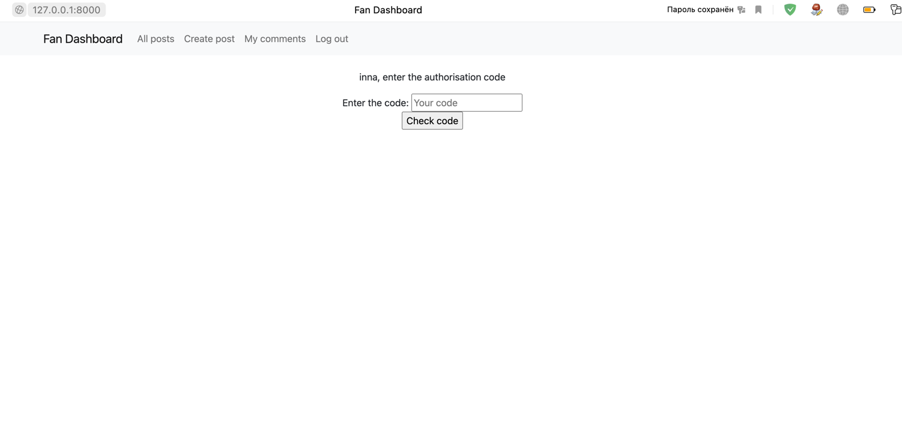
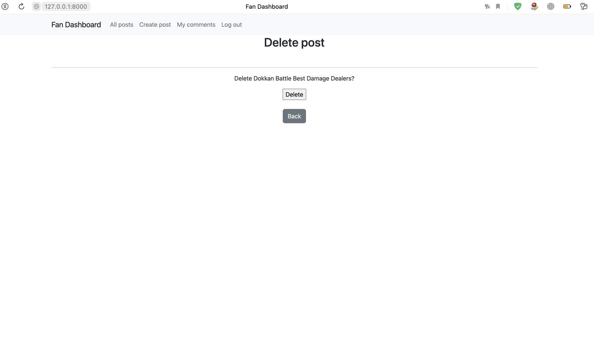

Проект "Fan dashboard"

ТЗ:

"Нам необходимо разработать интернет-ресурс для фанатского сервера одной известной MMORPG — что-то вроде доски объявлений. Пользователи нашего ресурса должны иметь возможность зарегистрироваться в нём по e-mail, получив письмо с кодом подтверждения регистрации. После регистрации им становится доступно создание и редактирование объявлений. Объявления состоят из заголовка и текста, внутри которого могут быть картинки, встроенные видео и другой контент. Пользователи могут отправлять отклики на объявления других пользователей, состоящие из простого текста. При отправке отклика пользователь должен получить e-mail с оповещением о нём. Также пользователю должна быть доступна приватная страница с откликами на его объявления, внутри которой он может фильтровать отклики по объявлениям, удалять их и принимать (при принятии отклика пользователю, оставившему отклик, также должно прийти уведомление). Кроме того, пользователь обязательно должен определить объявление в одну из следующих категорий: Танки, Хилы, ДД, Торговцы, Гилдмастеры, Квестгиверы, Кузнецы, Кожевники, Зельевары, Мастера заклинаний.

Также мы бы хотели иметь возможность отправлять пользователям новостные рассылки."

Реализация:

На главной странице сайта незарегистрированному пользователю дается возможность просмотреть список постов:
В меню пользователю доступны кнопки регистрации или вхожа в систему

При клике на название поста-объявления незарегистрированный пользователь может прочитать как само объвление, так и отзывы на него

Пользователь может вернуться назад, либо кликнув на кномку "Back", либо на название сайта или копку "All posts" на панели меню
Также пользователю предлагается войти в систему, чтобы иметь возможность оставлять комментарии и публиковать свои посты/объявления

Чтобы зарегистрироваться, нужно кликнуть на соответствующую кнопку на панели меню

При регистрации пользователю на указанную электронную почту отправляется 4-знаяный код подтверждения, который нужно ввести на следующей странице, открывающейся автоматически

Если введен неверный код, пользователю предлагается либо попробовать еще раз зарегистрироваться, либо отменить регистрацию

Если пользователь уже пытался зарегистрироваться, но не прошел ее успешно, ему предложат сбросить результаты и снова зарегистрироваться

После успешной регистрации пользователю предлагается войти в систему. Здесь же добавлена кнопка "зарегистрироваться", на случай, если пользователь ранее не регистрировался

Администатору и менеджерам присылаются письма об успешной регистрации нового пользователя

После успешного входа в систему на панели меню появляются кнопки Создания поста/объявления и кнопка входа на личную страницу пользователя "Me comments", где отображаются отклики к постам/объявлениям пользователя

Кликнув на название любого поста, пользователь попадает на страницу с полным постом и теперь, после входа в систему, он может писать отклики/ комментарии к постам других пользователей. Но если он зайдет на страницу своего поста, окно с комментарием будет для него недоступно, то есть пользователь может писать комментарии/отклики только к чужим постам

После того, как он напишет комментарий/ отклик, он отправляется автору поста на рассмотрения, поэтому сразу не появляется на сайте.

При этом автору поста приходит уведомление на почту о новом отклике

И уведомление автору комментария:

В личном кабинете My comments  пользователь видит все комментарии к своим постам, если нет комментариев или постов, об этом написано на странице
Здесь пользователь имеет возможность принять или отклонить комментарий/отклик к своему посту/объявлению, а также отфильтровать их по нескольким параметрам

Если юзер принял комментарий, то автору комментария приходит уведомление, что комментарий принят

На всех страницах сайта добавлена удобная навигация, чтобы вернуться на любую страницу сайта. Если пользователь зарегистрирован, на панели меню становится доступной кнопка создания нового поста/лбъявления
При клике на кнопку он переходит на страницу создания поста
Пользователю предлагается выбрать одну из категорий для поста/объявления, вписать название и текст

При клике на значок с картинкой можно вставить картирку в текст
Картинка вставляется как ссылка на нее 

После публикации автору поста приходит уведомление на почту:

После публикации поста, если юзер является автором поста, он может его отредактировать или удалить. Сообвествующие кнопки становятся доступны для него на странице поста

